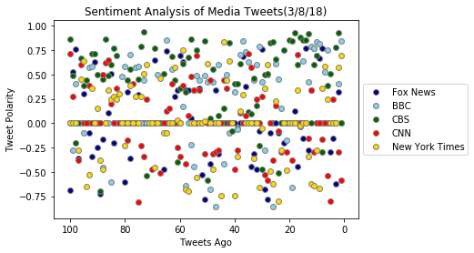
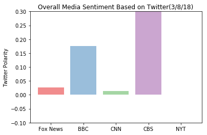

```python
# Dependencies
import tweepy
import json
import numpy as np
from datetime import datetime
import pandas as pd
import matplotlib.pyplot as plt
import seaborn as sns
```


```python
# Import and Initialize Sentiment Analyzer
from vaderSentiment.vaderSentiment import SentimentIntensityAnalyzer
analyzer = SentimentIntensityAnalyzer()

# Twitter API Keys
consumer_key = "xTlzQHMIqhfsSdU7pPjDM06h7"
consumer_secret = "QhWNwCS4RgF8K4dh30JcN2uZKlcRwS48CyoIKL6MkNknaNCY16"
access_token = "967430656409198592-5Nwp1puG2UEzoQfB2H9CXh9XrcCUqnx"
access_token_secret = "0yA8vgLUPyHhS1dZgQo2YAVLyUlOIio9BqudXUSOYLV21"

# Setup Tweepy API Authentication
auth = tweepy.OAuthHandler(consumer_key, consumer_secret)
auth.set_access_token(access_token, access_token_secret)
api = tweepy.API(auth)
```


```python
# Target User Accounts
target_user = {"@BBC": {"compound": [],"positive": [], "negative": [],"neutral": [], "date":[], "text":[]},
                      "@CBS": {"compound": [],"positive": [], "negative": [],"neutral": [],"date":[], "text":[]}, 
                      "@CNN": {"compound": [],"positive": [], "negative": [],"neutral": [], "date":[], "text":[]},
                      "@FoxNews": {"compound": [],"positive": [], "negative": [],"neutral": [], "date":[], "text":[]}, 
                      "@nytimes": {"compound": [],"positive": [], "negative": [],"neutral": [], "date":[], "text":[]}}

# Loop through each user
for user in target_user.keys():

    # Variables for holding sentiments
    compound_list = []
    positive_list = []
    negative_list = []
    neutral_list = []
    # Create array to record all date-times of tweets
    tweet_times = []
    # Array to store all converted tweets to date-time objects
    tweet_time_objects = []
    #Array to store all the text
    text_list = []
    # Calculate the time between tweets
    time_in_between = []

    # Use cursor to loop through 20 pages (total 200 tweets)
    for page in tweepy.Cursor(api.user_timeline, id=user).pages(5):
        # page is a list of statuses
        for tweet in page:
            tweet_text = json.dumps(tweet._json, indent=3)
            tweet = json.loads(tweet_text)
            text = tweet['text']
            # print(text)

            # Run Vader Analysis on each tweet
            compound = analyzer.polarity_scores(text)["compound"]
            pos = analyzer.polarity_scores(text)["pos"]
            neu = analyzer.polarity_scores(text)["neu"]
            neg = analyzer.polarity_scores(text)["neg"]
            

            # Add each value to the appropriate array
            compound_list.append(compound)
            positive_list.append(pos)
            negative_list.append(neg)
            neutral_list.append(neu)
            tweet_times.append(tweet["created_at"])
            text_list.append(tweet['text'])
    
    
   # Append everything 
    target_user[user]["compound"].extend(compound_list)
    target_user[user]["positive"].extend(positive_list)
    target_user[user]["negative"].extend(negative_list)
    target_user[user]["neutral"].extend(neutral_list)
    target_user[user]["date"].extend(tweet_times)
    target_user[user]["text"].extend(text_list) 

```


```python
NewsMood_df = pd.DataFrame(target_user)

NewsMood_df.head(10)
```


<div>
<style>
    .dataframe thead tr:only-child th {
        text-align: right;
    }

    .dataframe thead th {
        text-align: left;
    }

    .dataframe tbody tr th {
        vertical-align: top;
    }
</style>
<table border="1" class="dataframe">
  <thead>
    <tr style="text-align: right;">
      <th></th>
      <th>@BBC</th>
      <th>@CBS</th>
      <th>@CNN</th>
      <th>@FoxNews</th>
      <th>@nytimes</th>
    </tr>
  </thead>
  <tbody>
    <tr>
      <th>compound</th>
      <td>[0.0, -0.2732, 0.4019, 0.0, 0.0, -0.1027, 0.0,...</td>
      <td>[0.8625, 0.4926, -0.2023, 0.0, 0.6705, 0.3818,...</td>
      <td>[0.7096, 0.2732, 0.0, -0.3804, 0.5994, 0.0, 0....</td>
      <td>[-0.6908, 0.5267, 0.7579, -0.3612, 0.0, 0.3008...</td>
      <td>[0.0, 0.0, 0.0, -0.2732, 0.4528, 0.6369, -0.64...</td>
    </tr>
    <tr>
      <th>date</th>
      <td>[Thu Mar 08 21:28:00 +0000 2018, Thu Mar 08 21...</td>
      <td>[Thu Mar 08 18:00:49 +0000 2018, Thu Mar 08 17...</td>
      <td>[Fri Mar 09 05:01:05 +0000 2018, Fri Mar 09 04...</td>
      <td>[Fri Mar 09 05:00:00 +0000 2018, Fri Mar 09 04...</td>
      <td>[Fri Mar 09 05:02:11 +0000 2018, Fri Mar 09 04...</td>
    </tr>
    <tr>
      <th>negative</th>
      <td>[0.0, 0.103, 0.0, 0.0, 0.0, 0.177, 0.0, 0.0, 0...</td>
      <td>[0.0, 0.0, 0.23, 0.0, 0.0, 0.0, 0.0, 0.0, 0.0,...</td>
      <td>[0.091, 0.0, 0.0, 0.152, 0.0, 0.0, 0.0, 0.0, 0...</td>
      <td>[0.449, 0.0, 0.0, 0.204, 0.0, 0.0, 0.0, 0.167,...</td>
      <td>[0.0, 0.0, 0.0, 0.118, 0.072, 0.0, 0.272, 0.23...</td>
    </tr>
    <tr>
      <th>neutral</th>
      <td>[1.0, 0.845, 0.856, 1.0, 1.0, 0.664, 1.0, 0.76...</td>
      <td>[0.664, 0.868, 0.619, 1.0, 0.756, 0.833, 0.884...</td>
      <td>[0.594, 0.861, 1.0, 0.848, 0.811, 1.0, 1.0, 0....</td>
      <td>[0.551, 0.805, 0.772, 0.711, 1.0, 0.844, 1.0, ...</td>
      <td>[1.0, 1.0, 1.0, 0.814, 0.78, 0.704, 0.623, 0.7...</td>
    </tr>
    <tr>
      <th>positive</th>
      <td>[0.0, 0.052, 0.144, 0.0, 0.0, 0.159, 0.0, 0.23...</td>
      <td>[0.336, 0.132, 0.15, 0.0, 0.244, 0.167, 0.116,...</td>
      <td>[0.315, 0.139, 0.0, 0.0, 0.189, 0.0, 0.0, 0.14...</td>
      <td>[0.0, 0.195, 0.228, 0.085, 0.0, 0.156, 0.0, 0....</td>
      <td>[0.0, 0.0, 0.0, 0.068, 0.148, 0.296, 0.105, 0....</td>
    </tr>
    <tr>
      <th>text</th>
      <td>[This Ancient Egyptian pharaoh invested more i...</td>
      <td>[Today and every day we celebrate the women in...</td>
      <td>[With America facing a massive nursing shortag...</td>
      <td>[Dreamers to Democrats: We're tired of your li...</td>
      <td>[Since 1851, obituaries in The New York Times ...</td>
    </tr>
  </tbody>
</table>
</div>


```python
c1="darkblue" 
c2="skyblue"
c3="darkgreen"
c4="red"
c5="gold"
edge = ["grey"]

x = np.arange(0,len(NewsMood_df.loc["compound", "@FoxNews"]))

# Create ScatterPlot
plt.scatter(x=x, y=NewsMood_df.loc["compound", "@FoxNews"], c=c1, marker='o', edgecolors=edge, alpha=1, label='Fox News') 
plt.scatter(x=x, y=NewsMood_df.loc["compound", "@BBC"], c=c2, marker='o', edgecolors=edge, alpha=1, label='BBC')
plt.scatter(x=x, y=NewsMood_df.loc["compound", "@CBS"], c=c3, marker='o', edgecolors=edge, alpha=1, label='CBS') 
plt.scatter(x=x, y=NewsMood_df.loc["compound", "@CNN"], c=c4, marker='o', edgecolors=edge, alpha=1, label='CNN') 
plt.scatter(x=x, y=NewsMood_df.loc["compound", "@nytimes"], c=c5, marker='o', edgecolors=edge, alpha=1, label='New York Times') 
plt.legend(loc='center left', bbox_to_anchor=(1, 0.5))

# Titles and grids
plt.title("Sentiment Analysis of Media Tweets(3/8/18)")
plt.xticks(np.arange(0, len(x) + 1, 20), np.arange(0, len(x) + 1, 20)[::-1])
plt.xlabel("Tweets Ago")
plt.ylabel("Tweet Polarity")
# Print Scatter Plot
plt.show()
```





```python
# Bar plot
objects = ('Fox News', 'BBC', 'CNN', 'CBS', 'NYT')
y_pos = np.arange(len(objects))
performance = [np.mean(NewsMood_df.loc["compound", "@FoxNews"]),
               np.mean(NewsMood_df.loc["compound", "@BBC"]),
               np.mean(NewsMood_df.loc["compound", "@CNN"]),
               np.mean(NewsMood_df.loc["compound", "@CBS"]),
               np.mean(NewsMood_df.loc["compound", "@nytimes"])]
 
plt.bar(y_pos, performance, align='center', alpha=0.5, color=sns.color_palette("Set1"))
plt.ylim(-0.10, 0.30)
plt.xticks(y_pos, objects)
plt.ylabel('Twitter Polarity')
plt.title('Overall Media Sentiment Based on Twitter(3/8/18)')
 
plt.show()
```





```python
# Save dataframe to CSV
NewsMood_df.to_csv('NewsMood.csv')
```
