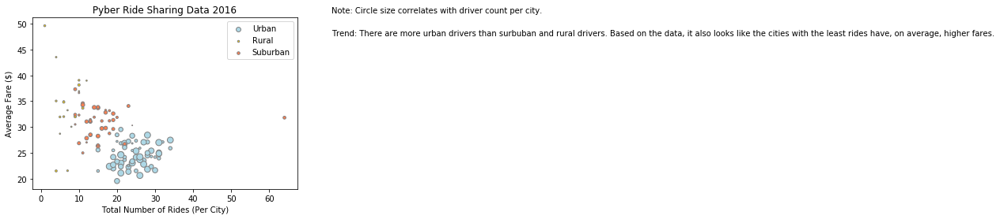
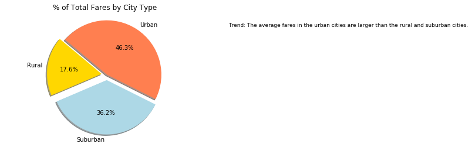
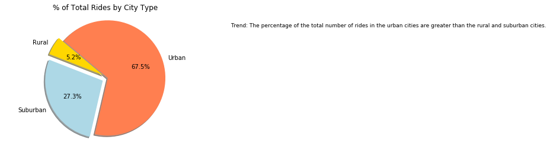
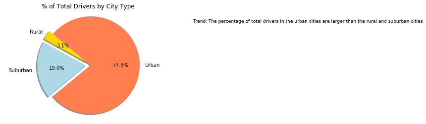

```python
# Import Dependencies
import numpy as np
import matplotlib.pyplot as plt
import pandas as pd
```


```python
# File to Load (Remember to Change These)
city_data_to_load = "city_data.csv"
ride_data_to_load = "ride_data.csv"

# Read data & store into pandas dataframe
City_df = pd.read_csv("city_data.csv")
Ride_df = pd.read_csv("ride_data.csv")

# Combine the data into a single dataset
ride_data_complete = pd.merge(Ride_df,City_df, how="inner", on=["city","city"])
# ride_data_complete.set_index('city')
ride_data_complete.head()
```


<div>
<style>
    .dataframe thead tr:only-child th {
        text-align: right;
    }

    .dataframe thead th {
        text-align: left;
    }

    .dataframe tbody tr th {
        vertical-align: top;
    }
</style>
<table border="1" class="dataframe">
  <thead>
    <tr style="text-align: right;">
      <th></th>
      <th>city</th>
      <th>date</th>
      <th>fare</th>
      <th>ride_id</th>
      <th>driver_count</th>
      <th>type</th>
    </tr>
  </thead>
  <tbody>
    <tr>
      <th>0</th>
      <td>Sarabury</td>
      <td>2016-01-16 13:49:27</td>
      <td>38.35</td>
      <td>5403689035038</td>
      <td>46</td>
      <td>Urban</td>
    </tr>
    <tr>
      <th>1</th>
      <td>Sarabury</td>
      <td>2016-07-23 07:42:44</td>
      <td>21.76</td>
      <td>7546681945283</td>
      <td>46</td>
      <td>Urban</td>
    </tr>
    <tr>
      <th>2</th>
      <td>Sarabury</td>
      <td>2016-04-02 04:32:25</td>
      <td>38.03</td>
      <td>4932495851866</td>
      <td>46</td>
      <td>Urban</td>
    </tr>
    <tr>
      <th>3</th>
      <td>Sarabury</td>
      <td>2016-06-23 05:03:41</td>
      <td>26.82</td>
      <td>6711035373406</td>
      <td>46</td>
      <td>Urban</td>
    </tr>
    <tr>
      <th>4</th>
      <td>Sarabury</td>
      <td>2016-09-30 12:48:34</td>
      <td>30.30</td>
      <td>6388737278232</td>
      <td>46</td>
      <td>Urban</td>
    </tr>
  </tbody>
</table>
</div>


```python
urban_df = ride_data_complete[ride_data_complete["type"] == "Urban"]
urban_fare = urban_df.groupby(["city"]).mean()["fare"]
urban_ride = urban_df.groupby(["city"]).count()["ride_id"]
urban_drive = urban_df.groupby(["city"]).first()["driver_count"]
urban_ride_id = urban_df.groupby(["city"]).first()["ride_id"]
urban_date = urban_df.groupby(["city"]).first()["date"]


urban_summary_df = pd.DataFrame({"Average Fare ($) Per City": urban_fare,
                                 "Total Number of Rides Per City": urban_ride,
                                 "Total Number of Drivers Per City": urban_drive,
                                 "Ride ID": urban_ride_id,
                                 "Date": urban_date})
urban_summary_df.head(5)
```


<div>
<style>
    .dataframe thead tr:only-child th {
        text-align: right;
    }

    .dataframe thead th {
        text-align: left;
    }

    .dataframe tbody tr th {
        vertical-align: top;
    }
</style>
<table border="1" class="dataframe">
  <thead>
    <tr style="text-align: right;">
      <th></th>
      <th>Average Fare ($) Per City</th>
      <th>Date</th>
      <th>Ride ID</th>
      <th>Total Number of Drivers Per City</th>
      <th>Total Number of Rides Per City</th>
    </tr>
    <tr>
      <th>city</th>
      <th></th>
      <th></th>
      <th></th>
      <th></th>
      <th></th>
    </tr>
  </thead>
  <tbody>
    <tr>
      <th>Alvarezhaven</th>
      <td>23.928710</td>
      <td>2016-04-18 20:51:29</td>
      <td>4267015736324</td>
      <td>21</td>
      <td>31</td>
    </tr>
    <tr>
      <th>Alyssaberg</th>
      <td>20.609615</td>
      <td>2016-05-28 09:20:29</td>
      <td>7474701747862</td>
      <td>67</td>
      <td>26</td>
    </tr>
    <tr>
      <th>Antoniomouth</th>
      <td>23.625000</td>
      <td>2016-03-05 02:55:42</td>
      <td>644874337642</td>
      <td>21</td>
      <td>22</td>
    </tr>
    <tr>
      <th>Aprilchester</th>
      <td>21.981579</td>
      <td>2016-05-11 07:04:30</td>
      <td>1081687614611</td>
      <td>49</td>
      <td>19</td>
    </tr>
    <tr>
      <th>Arnoldview</th>
      <td>25.106452</td>
      <td>2016-03-24 05:50:15</td>
      <td>9909352484494</td>
      <td>41</td>
      <td>31</td>
    </tr>
  </tbody>
</table>
</div>


```python
rural_df = ride_data_complete[ ride_data_complete["type"] == "Rural"]
rural_fare = rural_df.groupby(["city"]).mean()["fare"]
rural_ride = rural_df.groupby(["city"]).count()["ride_id"]
rural_drive = rural_df.groupby(["city"]).first()["driver_count"]
rural_ride_id = rural_df.groupby(["city"]).first()["ride_id"]
rural_date = rural_df.groupby(["city"]).first()["date"]


rural_summary_df = pd.DataFrame({"Average Fare ($) Per City": rural_fare,
                                 "Total Number of Rides Per City": rural_ride,
                                 "Total Number of Drivers Per City": rural_drive,
                                 "Ride ID": rural_ride_id,
                                 "Date": rural_date})
rural_summary_df.head(5)
```


<div>
<style>
    .dataframe thead tr:only-child th {
        text-align: right;
    }

    .dataframe thead th {
        text-align: left;
    }

    .dataframe tbody tr th {
        vertical-align: top;
    }
</style>
<table border="1" class="dataframe">
  <thead>
    <tr style="text-align: right;">
      <th></th>
      <th>Average Fare ($) Per City</th>
      <th>Date</th>
      <th>Ride ID</th>
      <th>Total Number of Drivers Per City</th>
      <th>Total Number of Rides Per City</th>
    </tr>
    <tr>
      <th>city</th>
      <th></th>
      <th></th>
      <th></th>
      <th></th>
      <th></th>
    </tr>
  </thead>
  <tbody>
    <tr>
      <th>East Leslie</th>
      <td>33.660909</td>
      <td>2016-04-21 18:44:59</td>
      <td>5836114186294</td>
      <td>9</td>
      <td>11</td>
    </tr>
    <tr>
      <th>East Stephen</th>
      <td>39.053000</td>
      <td>2016-02-16 11:58:06</td>
      <td>8118042484039</td>
      <td>6</td>
      <td>10</td>
    </tr>
    <tr>
      <th>East Troybury</th>
      <td>33.244286</td>
      <td>2016-02-21 06:07:18</td>
      <td>1607319707836</td>
      <td>3</td>
      <td>7</td>
    </tr>
    <tr>
      <th>Erikport</th>
      <td>30.043750</td>
      <td>2016-01-01 18:05:56</td>
      <td>3568184448232</td>
      <td>3</td>
      <td>8</td>
    </tr>
    <tr>
      <th>Hernandezshire</th>
      <td>32.002222</td>
      <td>2016-02-20 08:17:32</td>
      <td>3176534714830</td>
      <td>10</td>
      <td>9</td>
    </tr>
  </tbody>
</table>
</div>


```python
suburban_df = ride_data_complete[ ride_data_complete["type"] == "Suburban"]
suburban_fare = suburban_df.groupby(["city"]).mean()["fare"]
suburban_ride = suburban_df.groupby(["city"]).count()["ride_id"]
suburban_drive = suburban_df.groupby(["city"]).first()["driver_count"]
suburban_ride_id = suburban_df.groupby(["city"]).first()["ride_id"]
suburban_date = suburban_df.groupby(["city"]).first()["date"]


suburban_summary_df = pd.DataFrame({"Average Fare ($) Per City": suburban_fare,
                                    "Total Number of Rides Per City": suburban_ride,
                                    "Total Number of Drivers Per City": suburban_drive,
                                    "Ride ID": suburban_ride_id,
                                    "Date": suburban_date})
suburban_summary_df.head(5)
```


<div>
<style>
    .dataframe thead tr:only-child th {
        text-align: right;
    }

    .dataframe thead th {
        text-align: left;
    }

    .dataframe tbody tr th {
        vertical-align: top;
    }
</style>
<table border="1" class="dataframe">
  <thead>
    <tr style="text-align: right;">
      <th></th>
      <th>Average Fare ($) Per City</th>
      <th>Date</th>
      <th>Ride ID</th>
      <th>Total Number of Drivers Per City</th>
      <th>Total Number of Rides Per City</th>
    </tr>
    <tr>
      <th>city</th>
      <th></th>
      <th></th>
      <th></th>
      <th></th>
      <th></th>
    </tr>
  </thead>
  <tbody>
    <tr>
      <th>Anitamouth</th>
      <td>37.315556</td>
      <td>2016-01-03 16:21:46</td>
      <td>2473012019465</td>
      <td>16</td>
      <td>9</td>
    </tr>
    <tr>
      <th>Campbellport</th>
      <td>33.711333</td>
      <td>2016-03-02 09:59:04</td>
      <td>5956974893832</td>
      <td>26</td>
      <td>15</td>
    </tr>
    <tr>
      <th>Carrollbury</th>
      <td>36.606000</td>
      <td>2016-05-09 03:12:10</td>
      <td>485795568537</td>
      <td>4</td>
      <td>10</td>
    </tr>
    <tr>
      <th>Clarkstad</th>
      <td>31.051667</td>
      <td>2016-07-15 16:34:16</td>
      <td>5858467951626</td>
      <td>21</td>
      <td>12</td>
    </tr>
    <tr>
      <th>Conwaymouth</th>
      <td>34.591818</td>
      <td>2016-10-14 03:11:59</td>
      <td>772729607555</td>
      <td>18</td>
      <td>11</td>
    </tr>
  </tbody>
</table>
</div>


```python
c1="lightblue" 
c2="gold"
c3="coral"
edge = ["grey"]
plt.scatter(x=urban_ride, y=urban_fare, s=urban_drive*.90, c=c1, marker='o', edgecolors=edge, alpha=1, label='Urban') 
plt.scatter(x=rural_ride, y=rural_fare, s=rural_drive*.90, c=c2, marker='o', edgecolors=edge, alpha=1, label='Rural')
plt.scatter(x=suburban_ride, y=suburban_fare, s=suburban_drive*.90, c=c3, marker='o', edgecolors=edge, alpha=1, label='Suburban') 
plt.legend()

# Titles and grids
plt.title("Pyber Ride Sharing Data 2016")
plt.xlabel("Total Number of Rides (Per City)")
plt.ylabel("Average Fare ($)")
# BOTTOM LABEL
plt.figtext(1,0.9, "Note: Circle size correlates with driver count per city.", fontsize=10)

#Trend
plt.figtext(1,0.8, "Trend: There are more urban drivers than surbuban and rural drivers. Based on the data, it also looks like the cities with the least rides have, on average, higher fares.", fontsize=10)
# Print Scatter Plot
plt.show()
```





```python
# Labels for the sections of our pie chart
labels = "Rural", "Suburban", "Urban"

# The values of each section of the pie chart
sum_rural= rural_fare.sum()
sum_urban= urban_fare.sum()
sum_sub= suburban_fare.sum()
sizes = [sum_rural, sum_sub, sum_urban]

# The colors of each section of the pie chart
colors = ["gold", "lightblue", "coral"]

# Tells matplotlib to seperate the "Python" section from the others
explode = (0.1, 0.1, 0, )

# Automatically finds the percentages of each part of the pie chart
plt.pie(sizes, explode=explode, labels=labels, colors=colors,
        autopct="%1.1f%%", shadow=True, startangle=140)

# Tells matplotlib that we want a pie chart with equal axes
plt.axis("equal")

#Title
plt.title("% of Total Fares by City Type")

# Trend
plt.figtext(1,0.8, "Trend: The average fares in the urban cities are larger than the rural and suburban cities.", fontsize=9)

# Prints our pie chart to the screen
plt.show()
```





```python
# Labels for the sections of our pie chart
labels = "Rural", "Suburban", "Urban"

# The values of each section of the pie chart
sum_rural= rural_ride.sum()
sum_urban= urban_ride.sum()
sum_sub= suburban_ride.sum()
sizes = [sum_rural, sum_sub, sum_urban]

# The colors of each section of the pie chart
colors = ["gold", "lightblue", "coral"]

# Tells matplotlib to seperate the "Python" section from the others
explode = (0.1, 0.1, 0,)

# Automatically finds the percentages of each part of the pie chart
plt.pie(sizes, explode=explode, labels=labels, colors=colors,
        autopct="%1.1f%%", shadow=True, startangle=140)

# Tells matplotlib that we want a pie chart with equal axes
plt.axis("equal")

# Trend
plt.figtext(1,0.8, "Trend: The percentage of the total number of rides in the urban cities are greater than the rural and suburban cities.", fontsize=9)

#Title
plt.title("% of Total Rides by City Type")

# Prints our pie chart to the screen
plt.show()
```





```python
# Labels for the sections of our pie chart
labels = "Rural", "Suburban", "Urban"

# The values of each section of the pie chart
sum_rural= rural_drive.sum()
sum_urban= urban_drive.sum()
sum_sub= suburban_drive.sum()
sizes = [sum_rural, sum_sub, sum_urban]

# The colors of each section of the pie chart
colors = ["gold", "lightblue", "coral"]

# Tells matplotlib to seperate the "Python" section from the others
explode = (0.1, 0.1, 0,)

# Automatically finds the percentages of each part of the pie chart
plt.pie(sizes, explode=explode, labels=labels, colors=colors,
        autopct="%1.1f%%", shadow=True, startangle=140)

# Tells matplotlib that we want a pie chart with equal axes
plt.axis("equal")

# Trend
plt.figtext(1,0.8, "Trend: The percentage of total drivers in the urban cities are larger than the rural and suburban cities", fontsize=9)

#Title
plt.title("% of Total Drivers by City Type")

# Prints our pie chart to the screen
plt.show()
```




